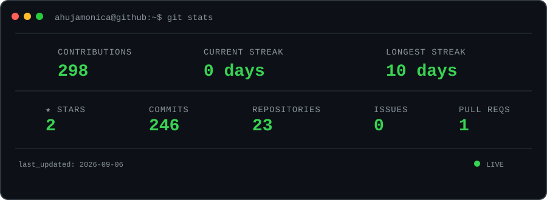

<div align="center">


</div>

<br>

<div align="center">

[](https://github.com/ahujamonica)
[](https://www.linkedin.com/in/monica-ahuja01/)
[](https://leetcode.com/u/_monicaaa/)
[](mailto:ahujamonica9321@gmail.com)

</div>

---

## `$ whoami`

<table width="100%">
<tr>

<td width="52%" valign="middle">

```text
monica@github:~$ whoami

name            : Monica Ahuja
role            : Software Engineer
specialization  : Java Backend Development
education       : Computer Engineering
location        : Mumbai, India

interests:
  ├── Backend Development
  ├── Full Stack Development
  ├── Data Structures & Algorithms
  └── Building Real-World Products
```

</td>

<td width="48%" align="center" valign="middle">

<a href="https://leetcode.com/u/_monicaaa/">
  
</a>

</td>

</tr>
</table>


---
## `$ tree tech-stack/`

<p align="center">
  
  &nbsp;&nbsp;
  
  &nbsp;&nbsp;
  
  &nbsp;&nbsp;
  
  &nbsp;&nbsp;
  
  &nbsp;&nbsp;
  
  &nbsp;&nbsp;
  
  &nbsp;&nbsp;
  
  &nbsp;&nbsp;
  
  &nbsp;&nbsp;
  
  &nbsp;&nbsp;
  
</p>

<p align="center">
  
  &nbsp;&nbsp;
  
  &nbsp;&nbsp;
  
  &nbsp;&nbsp;
  
  &nbsp;&nbsp;
  
  &nbsp;&nbsp;
  
  &nbsp;&nbsp;
  
  &nbsp;&nbsp;
  
  &nbsp;&nbsp;
  
  &nbsp;&nbsp;
  
</p>

---

## `$ ls projects/`

### `01` — CareerFlow

> **Job Application Lifecycle Manager**

A full-stack platform for managing job applications, resume versions, interviews, and application analytics.

**Stack:** `Java` `Spring Boot` `React` `MySQL` `JWT` `Recharts`

[](https://github.com/ahujamonica/CareerFlow)

---

### `02` — VirtualMouse

> **Real-Time Hand Gesture Controller**

A touchless virtual mouse that uses hand tracking to control cursor movement, clicking, and dragging through webcam gestures.

**Stack:** `React` `TypeScript` `Python` `MediaPipe` `WebSockets` `PyAutoGUI`

[](https://github.com/ahujamonica/VirtualMouse)

---

## `$ git stats`

<p align="center">
  
</p>

---

## `$ contribution-snake`

<p align="center">
  
</p>
